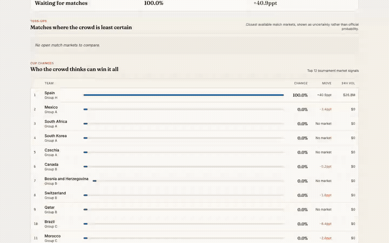
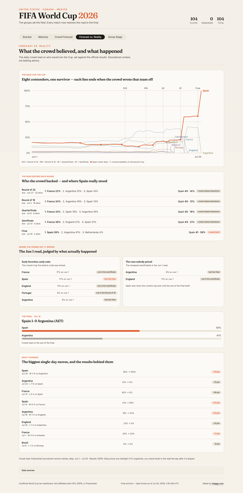

# World Cup Hub

An unofficial 2026 FIFA World Cup dashboard, frozen as a permanent archive after the final whistle. Bracket-first, every match with its consequence, and a Forecast vs. Reality retrospective comparing the crowd's daily predictions with what actually happened.

**Live archive:** [nawewe.xyz](https://nawewe.xyz)



[Full 59-second tour (MP4)](docs/media/demo.mp4) · [Case study: how it was built and why it was frozen](docs/case-study.md)

## What it shows

- **Bracket:** the knockout board as the main map, ending with Spain 1–0 Argentina (AET) at MetLife Stadium.
- **Matches:** all 104 games with states like `LIVE NOW` and `FULL TIME`, plus consequence copy such as `advance` and `win the Cup`.
- **Group Stage:** final tables for Groups A–L, automatic qualifiers, and the third-place pool.
- **Crowd Forecast:** the market read kept visually and technically separate from official results.
- **Forecast vs. Reality:** the archive's centerpiece, built from daily crowd prices and final results.

## The retrospective in three findings

- The crowd backed France through the entire knockout phase: favorite on the eve of every round, peaking at 39% before the semifinals. France lost that semifinal 0–2 to Spain.
- Spain, the eventual champion, never ranked above second in the crowd read before any round. The crowd only swung to Spain, 59%, on the eve of the final.
- Argentina reached the final at a June 1 price of 9%.



## How it works

Two pipelines with the same shape, kept separate in the model and on the page:

```text
ESPN scoreboard feed      -> validate -> transform -> match snapshot    -> bracket, matches, groups
Polymarket public markets -> validate -> transform -> forecast snapshot -> Crowd Forecast
```

External feeds are treated as untrusted. Payloads are validated at the boundary, malformed records are dropped one at a time, and a failed refresh never overwrites known-good data.

The archive is baked at build time. `bun run build:archive` sets a flag that makes both server functions return frozen, repo-committed snapshots before any fetch, so the deployed worker makes zero upstream calls. The footer shows the freeze date. Boundary tests assert the frozen files are sound: 104 complete matches, every round populated, probabilities in range.

## Engineering notes

- **Stack:** TanStack Start, React 19, TypeScript, Vite 8, Tailwind CSS 4, Bun, Cloudflare Workers.
- **Verification:** `bun run verify` runs typecheck, lint, 79 tests, and a production build. The deploy script refuses to run without it.
- **Headers:** security and cache headers are injected into the built worker by `scripts/inject-headers.mjs`.
- **Freeze tooling:** `bun run capture:snapshots` (final results and forecast) and `bun run capture:forecast-history` (48 teams of daily price history) write validated JSON into `src/data/frozen/`.
- **Retrospective:** `bun run build:retrospective` computes the retrospective artifact offline from the frozen data. The UI renders it statically.
- **Demo capture:** `bun run record:demo` records the archive tour and stills in `docs/media/` via Playwright.

## Development

```sh
bun install --frozen-lockfile
bun run dev
bun run verify
```

## Deploy

```sh
ARCHIVE_MODE=1 ./scripts/deploy.sh production
```

## Status

Unofficial fan project. Not affiliated with FIFA, ESPN, or Polymarket. Forecast content is educational context, not betting, trading, financial, or investment advice.
